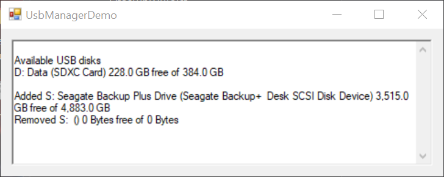

# UsbManager

This is a copy of <a href="https://www.codeproject.com/Articles/63878/Enumerate-and-Auto-Detect-USB-Drives">my original article on codeproject</a>.

List USB devices, monitor online state, using System.Management WMI wrappers

<h2>Introduction</h2>

This article describes how to use the .NET <code>System.Management </code>WMI (Windows Management Instrumentation) wrappers to enumerate and describe USB disk drives. It also includes a non-Interop solution for detecting drive state changes as they come online or go offline.

<h2>Contents</h2>

<ul>
	<li><a href="#Background">Background</a></li>
	<li><a href="#UsingTheCode">Using the Code</a></li>
	<li><a href="#InsideTheCode">Inside the Code</a>
	<ul>
		<li><a href="#AWalkAroundWMI">A Walk Around the WMI Classes</a></li>
		<li><a href="#SysManagement">Implementing the WMI Queries Using System.Management</a></li>
		<li><a href="#Intercepting">Intercepting Drive State Changes</a></li>
	</ul>
	</li>
	<li><a href="#StateChanged">The StateChanged Event</a></li>
	<li><a href="#Conclusion">Conclusion</a></li>
</ul>

<h2><a name="Background">Background</a></h2>

While writing <a href="http://ituner.codeplex.com/">iTuner</a>, I needed to be able to enumerate USB disk drives (MP3 players) and allow the user to select one with which iTuner could synchronize iTunes playlists. In order to select the correct device, the user needs some basic identifying information beyond just drive letter such as volume name, manufacturer&#39;s model name, and available disk space. As an added feature, I wanted the UI to update automatically as USB drives come online or go offline. Finally, I wanted to accomplish this through a tidy, simple interface that did not add tremendous complexity to the main application.

<em>Caveat:</em> The <code>UsbManager.GetAvailableDisks </code>method can be run in any application type. However, the <code>StateChanged </code>event will not be fired unless running in the context of a WPF or Windows Forms application. This is because the event handler relies on Windows message processing to intercept these state changes as explained below.

<h2><a name="UsingTheCode">Using the Code</a></h2>

As an application developer and consumer of this API, you first need an instance of the <code>UsbManager</code> class. This class exposes a very simple interface:

<pre lang="cs">
class UsbManager : IDisposable
{
    public UsbManager ();
    public event UsbStateChangedEventHandler StateChanged;
    public UsbDiskCollection GetAvailableDisks ();
}

class UsbDiskCollection : ObservableCollection&lt;UsbDisk&gt;
{
    public bool Contains (string name);
    public bool Remove (string name);
}

class UsbDisk
{
    public ulong FreeSpace { get; }
    public string Model { get; }
    public string Name { get; }
    public ulong Size { get; }
    public string Volume { get; }
    public string ToString ();
}</pre>

<ol>
	<li>Instantiate a new <code>UsbManager </code>using its parameterless constructor.</li>
	<li>Wire up an event handler to the <code>StateChanged</code> event.</li>
	<li>If desired, call <code>GetAvailableDisks</code> to retrieve a list of current USB disks.</li>
</ol>

The <code>UsbDisk</code> class abstracts the information pertaining to a particular USB disk. It includes only the most recognizable fields that a typical end user might use to differentiate drives such as the drive letter (Name), volume name, and manufacturer&#39;s model name. It also specifies the available free space and total disk size, both specified in bytes. While other information such as serial numbers, partition or sector data might be of interest to developers, they&#39;re quite esoteric to end users.

That&#39;s it! Happy coding! OK, keep reading if you want to understand how it&#39;s all put together.

<h2><a name="InsideTheCode">Inside the Code</a></h2>

Developing this API was first and foremost an exercise in discovering the WMI classes and their relationships. Unfortunately, WMI does not have a single <code>WMI_USBDiskDrive </code>class with all the properties we want. But the information is there. I started by using the <a href="http://www.ks-soft.net/hostmon.eng/wmi/index.htm">WMI Explorer</a> utility from KS-Soft. It&#39;s free and available for download on their Web site.

<h3><a name="AWalkAroundWMI">A Walk Around the WMI Classes</a></h3>

The first WMI class that draws your attention is <code>Win32_DiskDrive</code>. Drives are listed with creative and obvious names like &quot;<em>\\PHYSICALDRIVE0</em>&quot;. We can filter these by looking at only those with an <code>InterfaceType</code> property value of &quot;<code>USB</code>&quot;. <code>Win32_DiskDrive </code>also specifies the Model and Size of the drive. There are lots of other properties, but none are very interesting in this case. Here&#39;s the WMI query that retrieves the DeviceID and Model name for USB drives:

<pre lang="text">
select DeviceID, Model from Win32_DiskDrive where InterfaceType=&#39;USB&#39;</pre>

My next stop was the <code>Win32_LogicalDisk </code>class. This gets a bit more interesting right off the bat because instances are listed as drive letters like &quot;<em>C:</em>&quot;, &quot;<em>D:</em>&quot;, and &quot;<em>S:</em>&quot;. We can also fetch the <code>FreeSpace </code>and <code>VolumeName </code>properties. Here&#39;s the WMI query:

<pre lang="text">
select FreeSpace, Size, VolumeName from Win32_LogicalDisk where Name=&#39;S:&#39;</pre>

We now need a way to associate <code>Win32_DiskDrive </code>and <code>Win32_LogicalDisk </code>so we can marry these bits of information together. You might think there would be some shared field that allows you join the two classes. No such luck. And that&#39;s exactly where the Web came to the rescue and I discovered a bit of code tucked away <a href="http://msdn.microsoft.com/en-us/library/aa394592(VS.85).aspx">on MSDN</a> that demonstrates how to associate these classes. We can use the <code>associators</code> operator to discover associations between various classes. Given a <code>Win32_DiskDrive </code>instance, we can use its <code>DeviceID </code>property to determine the <code>Win32_DiskPartition </code>instance associated via <code>Win32_DiskDriveToDiskPartition</code>:

<pre lang="cs">
associators of {Win32_DiskDrive.DeviceID=&#39;\\PHYSICALDRIVE1&#39;}
      where AssocClass = Win32_DiskDriveToDiskPartition</pre>

Then using <code>Win32_DiskPartition.DeviceID</code>, we can determine the <code>Win32_LogicalDisk </code>instance associated via <code>Win32_LogicalDiskToPartition</code>:

<pre lang="cs">
associators of {Win32_DiskPartition.DeviceID=&#39;Disk #0, Partition #1&#39;}
      where AssocClass = Win32_LogicalDiskToPartition</pre>

<h3><a name="SysManagement">Implementing the WMI Queries Using System.Management</a></h3>

To execute a WMI query, we can use the <code>System.Management.ManagementObjectSearcher </code>class. This class always has the same pattern: search, get, enumerate as shown here:

<pre lang="cs">
ManagementObjectSearcher searcher = 
    new ManagementObjectSearcher(&quot;select * from Win32_DiskDrive&quot;);

ManagementObjectCollection items = searcher.Get();

foreach (ManagementObject item in items)
{
}</pre>

Given the cascading calls needed to query the four WMI classes, we would end up with a fairly ugly nesting of <code>foreach</code> loops. In order to clean this up and make the logic more obvious, I created a simple <em>extension method</em> for the <code>ManagementObjectSearcher</code> class. This extension adds a <code>First() </code>method to the <code>ManagementObjectSearcher </code>class that invokes its <code>Get </code>method, enumerates the resultant collection and immediately returns the first item in that collection:

<pre lang="cs">
public static ManagementObject First (this ManagementObjectSearcher searcher)
{
    ManagementObject result = null;
    foreach (ManagementObject item in searcher.Get())
    {
        result = item;
        break;
    }
    return result;
}</pre>

Combine this helper extension with the WMI queries above and we end up with a straightforward code in <code>UsbManager.GetAvailableDisks()</code>. Yes, we still have a nested structure, but testing for <code>null </code>is much more clear than the alternative!

<pre lang="cs">
public UsbDiskCollection GetAvailableDisks ()
{
    UsbDiskCollection disks = new UsbDiskCollection();

    // browse all USB WMI physical disks
    foreach (ManagementObject drive in
        new ManagementObjectSearcher(
            &quot;select DeviceID, Model from Win32_DiskDrive &quot; +
             &quot;where InterfaceType=&#39;USB&#39;&quot;).Get())
    {
        // associate physical disks with partitions
        ManagementObject partition = new ManagementObjectSearcher(String.Format(
            &quot;associators of {{Win32_DiskDrive.DeviceID=&#39;{0}&#39;}} &quot; +
                  &quot;where AssocClass = Win32_DiskDriveToDiskPartition&quot;,
            drive[&quot;DeviceID&quot;])).First();

        if (partition != null)
        {
            // associate partitions with logical disks (drive letter volumes)
            ManagementObject logical = new ManagementObjectSearcher(String.Format(
                &quot;associators of {{Win32_DiskPartition.DeviceID=&#39;{0}&#39;}} &quot; + 
                    &quot;where AssocClass= Win32_LogicalDiskToPartition&quot;,
                partition[&quot;DeviceID&quot;])).First();

            if (logical != null)
            {
                // finally find the logical disk entry
                ManagementObject volume = new ManagementObjectSearcher(String.Format(
                    &quot;select FreeSpace, Size, VolumeName from Win32_LogicalDisk &quot; +
                     &quot;where Name=&#39;{0}&#39;&quot;,
                    logical[&quot;Name&quot;])).First();

                UsbDisk disk = new UsbDisk(logical[&quot;Name&quot;].ToString());
                disk.Model = drive[&quot;Model&quot;].ToString();
                disk.Volume = volume[&quot;VolumeName&quot;].ToString();
                disk.FreeSpace = (ulong)volume[&quot;FreeSpace&quot;];
                disk.Size = (ulong)volume[&quot;Size&quot;];

                disks.Add(disk);
            }
        }
    }

    return disks;
}</pre>

<h3><a name="Intercepting">Intercepting Driver State Changes</a></h3>

Now that we can enumerate the currently available USB disk drives, it would be nice to know when one of these goes offline or a new drive comes online. This is the purpose of the <code>UsbManager.DriverWindow</code> class.

The <code>DriverWindow </code>class extends <code>System.Windows.Forms.NativeWindow </code>and is a <code>private </code>class encapsulated by <code>UsbManager</code>. The <code>WndProc </code>method of <code>NativeWindow </code>provides a convenient location to intercept and process Windows messages. The Windows message we need is <code>WM_DEVICECHANGE </code>and its <code>LParam </code>value must be <code>DBT_DEVTYP_VOLUME</code>. The <code>WParam </code>value is also important and we look for two DBT values (and an optional third).

<ul>
	<li><code>DBT_DEVICEARRIVAL </code>- broadcast when a device or piece of media has been inserted and becomes available</li>
	<li><code>DBT_DEVICEREMOVECOMPLETE </code>- broadcast when a device or piece of media has been physically removed</li>
	<li><code>DBT_DEVICEQUERYREMOVE </code>- broadcast to request permission to remove a device or piece of media; we do not process this message but it provides an opportunity to deny removal of a device</li>
</ul>

<code>DBT_DEVICEARRIVAL </code>and <code>DBT_DEVICEREMOVECOMPLETE </code>both deliver a <code>DEV_BROADCAST_VOLUME </code>struct. This is actually a <code>DEV_BROADCAST_HDR </code>whose <code>dbcv_devicetype </code>is set to <code>DBT_DEVTYP_VOLUME</code>, so we know we can cast the packet to a <code>DEV_BROADCAST_VOLUME</code>.

<pre lang="cs">
[StructLayout(LayoutKind.Sequential)]
public struct DEV_BROADCAST_VOLUME
{
    public int dbcv_size;       // size of the struct
    public int dbcv_devicetype; // DBT_DEVTYP_VOLUME
    public int dbcv_reserved;   // reserved; do not use
    public int dbcv_unitmask;   // Bit 0=A, bit 1=B, and so on (bitmask)
    public short dbcv_flags;    // DBTF_MEDIA=0x01, DBTF_NET=0x02 (bitmask)
}</pre>

The <code>dbcv_unitmask</code> field is a bitmask where each of the first 26 low-order bits correspond to a Windows drive letter. Apparently, it is possible to see a device associated with more than one drive letter but we only care about the first available for our use.

<code>DriverWindow </code>fires its own <code>StateChanged </code>event to signal <code>UsbManager</code>. <code>UsbManager </code>then decides if it needs to retrieve information - which it does for new arrivals - and then fires its own <code>StateChanged </code>event to signal consumers.

<h2><a name="StateChanged">The StateChanged Event</a></h2>

The demo app attached to this article shows all the power of <code>UsbManager </code>in just a few lines of code. It first enumerates all existing USB disk drives and displays them in a <code>TextBox</code>. It then wires up a handler to the <code>UsbManager.StateChanged </code>event. This event is defined as follows:

<pre lang="cs">
public event UsbStateChangedEventHandler StateChanged</pre>

Take a look at the <code>StateChanged </code>implementation and you&#39;ll notice that the <code>add</code> and <code>remove</code> statements have been extended. This allows us to instantiate a <code>DriverWindow </code>instance only when consumers are listening and then dispose it off when all consumers have stopped listening.

Your handler must be declared as a <code>UsbStateChangedEventHandler</code> as follows:

<pre lang="cs">
public delegate void UsbStateChangedEventHandler (UsbStateChangedEventArgs e);</pre>

And the <code>UsbStateChangedEventArgs</code> is declared as:

<pre lang="cs">
public class UsbStateChangedEventArgs : EventArgs
{
    public UsbDisk Disk;
    public UsbStateChange State;
}</pre>

<ul>
	<li>The <code>State</code> property is an <code>enum </code>specifying one of <code>Added</code>, <code>Removing</code>, or <code>Removed</code>.</li>
	<li>The <code>Disk</code> property is a <code>UsbDisk </code>instance. If <code>State </code>is <code>Added</code>, then all properties of Disk should be populated. However, if <code>State </code>is <code>Removing </code>or <code>Removed</code>, then only the <code>Name </code>property is populated since we can&#39;t detect attributes of a device that no longer exist.</li>
</ul>

<h2><a name="Conclusion">Conclusion</a></h2>

If you found this article helpful and enjoy the <a href="http://ituner.codeplex.com/">iTuner</a> application, please consider <a href="https://www.paypal.com/us/cgi-bin/webscr?cmd=_flow&amp;SESSION=rtJovw_M3GUl1asPOGuQPODe_c64F50_ZTq8wM38ayTV7jnCbkpif4fGdAa&amp;dispatch=5885d80a13c0db1fc53a056acd1538874a43d73a07f26b2caf7353d6a9263490">donating</a> to support continual improvements of iTuner and, hopefully, more helpful articles. Thanks!

